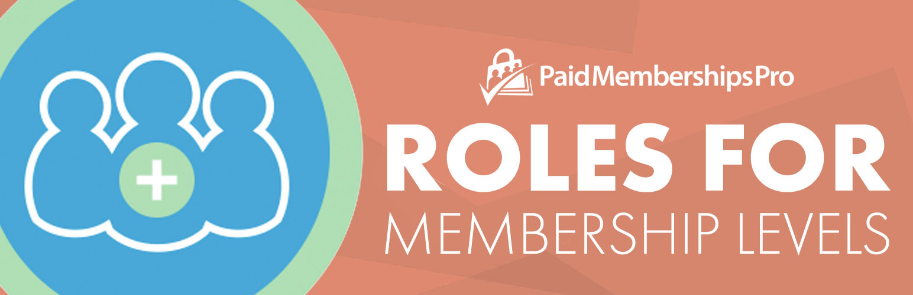

# [Roles for Membership Levels](https://www.paidmembershipspro.com/add-ons/pmpro-roles/) #
[comment]: # (Generate badges from shields.io, only works for .org plugins to get other stats etc. We'd have to create our own endpoints for Premium plugins)

### Welcome to the Roles for Membership Levels GitHub Repository
Add a description of the product here.

For more information please visit [paidmembershipspro.com/add-ons/pmpro-roles/](https://www.paidmembershipspro.com/add-ons/pmpro-roles/)

## Installation ##
For detailed installation steps, visit the [documentation](https://www.paidmembershipspro.com/add-ons/pmpro-roles/) page.

1. Download the current development ZIP file directly: `https://github.com/strangerstudios/pmpro-roles/archive/dev.zip`

**Please ensure that once installing this version of the plugin to remove `-dev` from the plugin's folder name.**

## Bugs ##
If you find an issue/bug, let us know by [creating a detailed GitHub issue](https://github.com/strangerstudios/pmpro-roles/issues/new).

## Support ##
This is a developer's portal for Roles for Membership Levels. We do not offer support on this channel. **Any support related questions should be directed to [paidmembershipspro.com/add-ons/pmpro-roles/](https://www.paidmembershipspro.com/add-ons/pmpro-roles/).**

## Contributing to Roles for Membership Levels ##
We encourage and welcome any contribution to Roles for Membership Levels. Please read the [guidelines for contributing](https://github.com/strangerstudios/pmpro-roles/blob/dev/.github/CONTRIBUTING.md) to this repository.

There are various **ways to the help development** of Roles for Membership Levels:

1. Report [bugs/issues](https://github.com/strangerstudios/pmpro-roles/issues/new) on GitHub.
2. Work on any issues by submitting a Pull Request.

Here are some ways for **non-developers to contribute** to Roles for Membership Levels:

1. Translate Roles for Membership Levels into your own [language](https://www.paidmembershipspro.com/paid-memberships-pro-in-your-language/).
2. [Purchase a plus membership](https://paidmembershipspro.com/pricing) to help fund ongoing development and bug fixes.